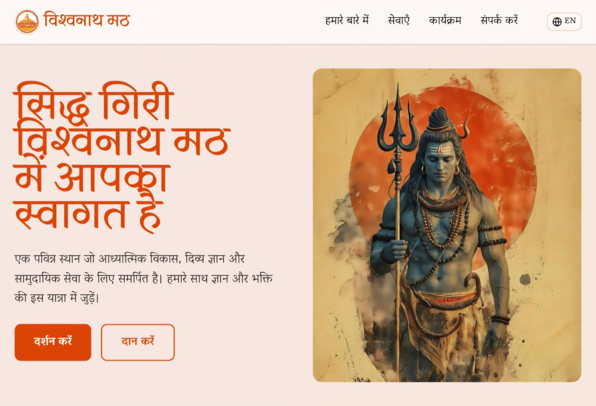

<div align="center">

# 🌸 **VishwanathMath — Spiritual Platform**  
### **Live at: https://www.vishwanathmath.in**

A spiritually inspired, professionally crafted web platform dedicated to  
**divine wisdom, spiritual growth, and community service**.

Built as a **freelancing project**, VishwanathMath provides a serene digital space  
to explore temple information, events, services, Guruji’s teachings, and more.

<br/>



</div>

---

## ✨ About the Project

VishwanathMath blends **tradition** with **modern web technology**, presenting:

- Temple & Ashram information  
- Guruji’s teachings  
- Gaushala details  
- Services & community work  
- Donation & contact sections  
- A divine-themed, visually soothing UI  

Designed with devotion towards **Lord Shiva** and the VishwanathMath community.

---

## 🚀 Tech Stack

- Next.js 14 (App Router)  
- React 18  
- Tailwind CSS  
- TypeScript (optional)  
- Vercel Deployment  
- GitHub Version Control  

---

## 📁 Folder Structure

VishwanathMath/
├── app/
├── components/
├── public/
├── styles/
├── package.json
└── README.md

yaml
Copy code

---

## ⚙️ Installation

```bash
git clone https://github.com/Somitraa/VishwanathMath.git
cd VishwanathMath
npm install
npm run dev
Open → http://localhost:3000

🏆 Badges
<p>       </p>
🤝 Contributing
sql
Copy code
Fork → Create Branch → Commit → Pull Request
❤️ Created By
Somitra Gupta
Full-stack Developer • Freelancer
Crafted with devotion for the VishwanathMath community.

🕉️ First Commit
The beginning of a divine digital journey.
Har Har Mahadev! 🙏
